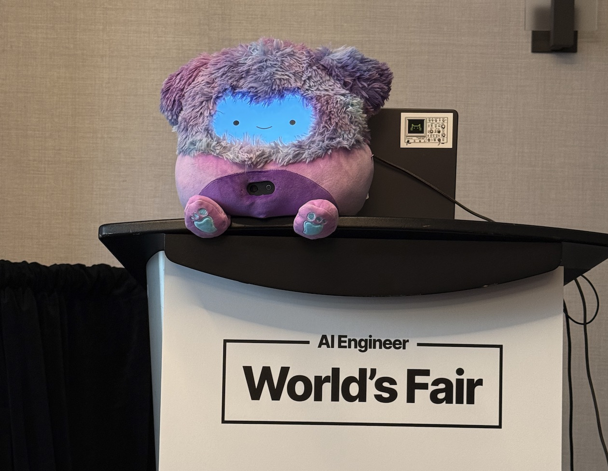
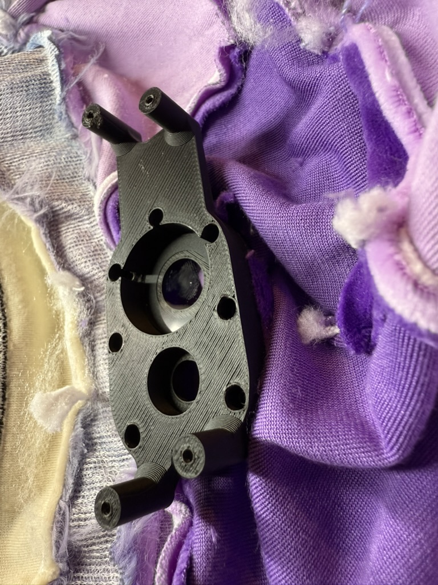
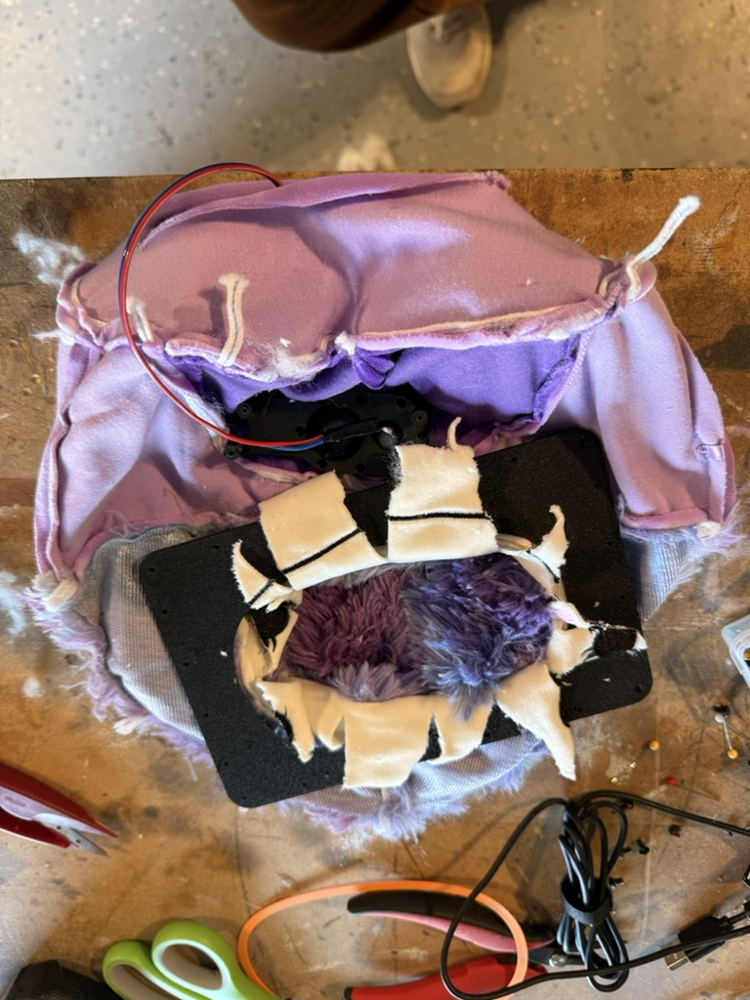

# Squobert

Squobert is a conversational AI agent built with [Pipecat](https://pipecat.ai) and running on [Pipecat Cloud](https://pipecat.daily.co). He was featured at the [2025 AI Engineer World's Fair](https://www.ai.engineer/) in San Francisco.



Squobert is powered by a Raspberry Pi and a Jabra 410 USB speaker/microphone. His face is a React app that runs in a fullscreen browser.

## Running the bot

```bash
cd bot
python -m venv venv
source venv/bin/activate
pip install -r requirements.txt
python bot.py -t daily
```

To deploy it to Pipecat Cloud, edit `bot/build.sh` and `bot/pcc-deploy.toml` and run:

```bash
cd bot
./build.sh
pcc deploy
```

There's also a GitHub Action in this repo to automatically build and deploy the Pipecat Cloud bot on pushes to `main`.

## Running the client UI

```
cd client
npm i
npm run dev
```

Then add a Pipecat Cloud public key to `client/src/providers/RTVIProvider.tsx`.

The client code is a bit of a mess to make the touch interactions work the way I wanted them to, but you should be able to understand it well enough to do something useful with it if you want. Claude wrote most of it, after all. :)

## Building your own

It's not for the faint of heart, but you totally can! Here's a parts list:

- [Squishmallows Eden The Purple Bigfoot, 10 inch](https://www.amazon.com/dp/B0CSLDZLJQ)
- Raspberry Pi, or similar small-ish PC
- [Jabra 410 Speakerphone](https://www.ebay.com/sch/i.html?_nkw=jabra+410&_sacat=0&_from=R40&_trksid=p4624852.m570.l1313). You're going to want one that has good built-in echo cancellation.
- [Logitech C925 Webcam](https://www.amazon.com/dp/B01DPNPJ72?ref_=ppx_hzsearch_conn_dt_b_fed_asin_title_2) (or similar)
- [A 7-inch HDMI touch screen like this one](https://www.amazon.com/dp/B0CRRB1GFN?ref_=ppx_hzsearch_conn_dt_b_fed_asin_title_3)

You'll also need a decent 3d printer for some of the parts. All of the parts are available in [this OnShape document](https://cad.onshape.com/documents/79ca64e7e60494e025231f8d/w/33e03df6ae7aac436b456b86/e/ba5b2d8304f2afcaa073064b). You might need to adapt the designs a bit to work with different hardware.

And be prepared to do some terrible things to a stuffed animal.




